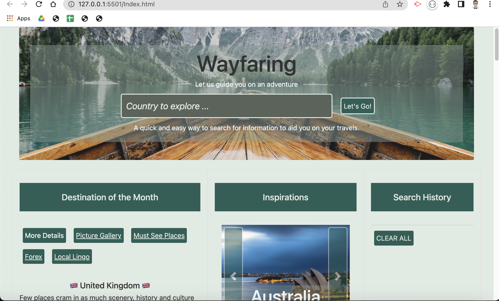

# Wayfaring

## Description

This project is part of the Frontend Development Bootcamp course challenge for the ninth and tenth week "Mini Project -  Interactive Front-End Application". 

Wayfaring app aims to inspire users with world destinations by providing details about these locations in a easy to view webpage. The app is the place to go to find all the important travel information about a country and its capital city. Every month, a destination of the month is featured on the webpage for traveling inspirations . 

User search history is stored in client-side browser storage. Currency Exchange rate conversions are also stored in local storage too.

This project is the collective efforts of:
* Nathalie Storey [Github Page](https://github.com/NCStorey)
* Tom King [Github Page](https://github.com/tomking1983)
* Pei Wang [Github Page](https://github.com/HaveTimeDrinkTea)

[Presentation Slides](https://docs.google.com/presentation/d/1bnM4-OF0T7CPwoMaE2mb_aHuBu3jWOozwjJ4sTsvkyc/edit?usp=sharing)

### Methodology: Wire Framing & Pseudo Code
* Wire framing for the Wayfaring app

* Pseudo Code
  * Use the REST Countries API to allow get information about one of the 240+ countries included in the API.
  * When a valid country is found, display the following information:
    * The country's basic details such as capital city, language, currency code, dialing code etc
    * Beautiful pictures of the selected country will be displayed.
    * Beautiful pictures of the other countries as traveling inspirations will also be displayed.    
    * A handy list of traveler's common questions such as "where is the nearest toilet?" is translated into local language.
    * Display currency exchange information based on the currency code.
    * A list of points of interest for the capital city is displayed with pictures and descriptions.

### Further Improvements
* Allow users to search by cities.
* Allow users to enter more phrases/questions that they want translated.
* Allow users to download the list of translation as a handy PDF for when they do not have internet access.
* Add a sound clip of each of the translated phrases or questions.
* Allow users to refine the Points of Interest search by various locations in a country.
* Add flight searching capabilities including Airport information.
* Add user's home country embassy contact details in the destination country.

## User Story
AS A world traveler

I WANT to find out useful details about a city or country 

SO THAT I can plan a trip accordingly

[Deployment link for Wayfaring App](https://tomking1983.github.io/wayfaring/)

## Acceptance Criteria
The main acceptance criteria are as follows: 
 * Use Bootstrap.
 * Be deployed to GitHub Pages.
 * Be interactive (i.e., accept and respond to user input).
 * Use at least two server-side APIs.
 * Does not use alerts, confirms, or prompts (use modals).
 * Use client-side storage to store persistent data.
 * Be responsive.
 * Have a polished UI.
 * Have a clean repository that meets quality coding standards (file structure, naming conventions, follows best practices for class/id naming conventions, indentation, quality comments, etc.).
 * Have a quality README (with unique name, description, technologies used, screenshot, and link to deployed application).

## Table of Contents (Optional)

* [Installation](#installation)
* [Usage](#usage)
* [Credits](#credits)
* [License](#license)
* [Features](#features)

## Installation

N.A.

## Usage 

Screen dumps of the deployed webpage:

### feature 

* Country information, beautiful scenic pictures and Currency Conversion

* Translations

* Points of Interests

* Error user input treatment

## Credits

* REST country API [www.restcountries.com](https://restcountries.com) 
* Pixabay API [www.pixabay.com](https://pixabay.com)
* MyMemory Translation API [www.mymemory.translated.net](https://mymemory.translated.net/doc/spec.php)
* Open Trip Map API [www.opentripmap.io/product](https://opentripmap.io/product)
* Exchange Rate [www.exchangerate-api.com](https://www.exchangerate-api.com)

## License 

MIT License

## Features

### Main Features
* An enticing homepage with images of beautiful sceneries that will evoke a user's desires to travel.
* Users can search for any of the 240+ countries as listed by [ISO 3166-1](https://en.wikipedia.org/wiki/ISO_3166-1#Current_codes). 
* When a user searched for a valid country, details of the country such as capital city, currency, dialing code etc are presented.
* Users will be presented with beautiful pictures of the selected country/city.
* A handy list of common phrases/questions that a travel might need translated is also presented in the local language.
* The destination country's currency is converted to 4 main currencies (USD, EUR, CNY and GBP). If the destination country's currency is one of the 4 main currencies then its exchange conversion will be excluded.
* A list of points of interests within 3km of the capital city is also presented with pictures and descriptions where available from wikipedia.
* User search history is stored in client-side browser storage. Users can also delete their Wayfaring search history at a click of a button.

  

### Extra Features
 * Destination of the month featuring a specific country on page load.
 * A dynanmically displayed button allowing users to go back to "Destination of the Month" when viewing any other country.
 

